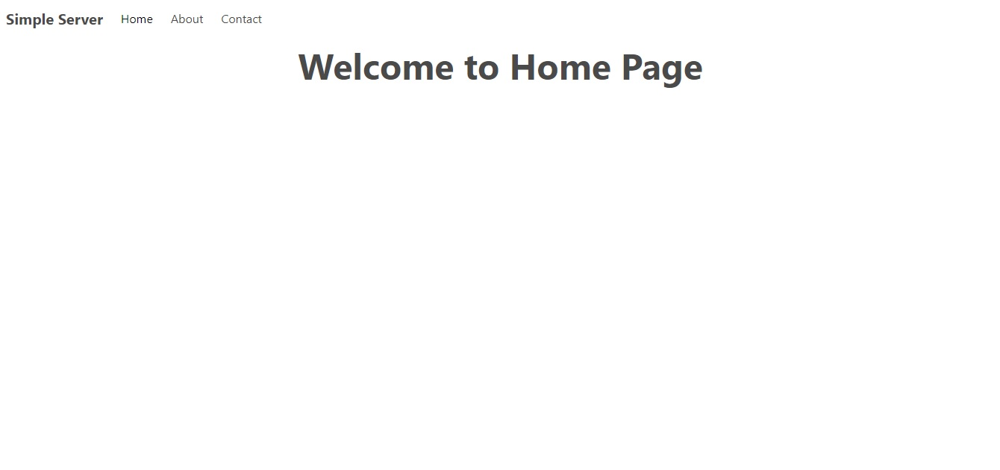

# Basic Web Server

## Description

A simple web server built using Node.js
A basic web server created using Node.js with no frameworks. It aims to give a rough example of how servers on a framework could be created and managed.

### Screenshot

### Technologies

- Node
- JavaScript
- HTML
- CSS

## How to Use

No installation required. Once on your machine, to start the server, run the follow command in the root directory:
`npm start`
